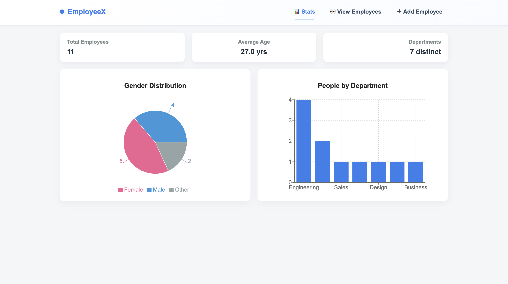
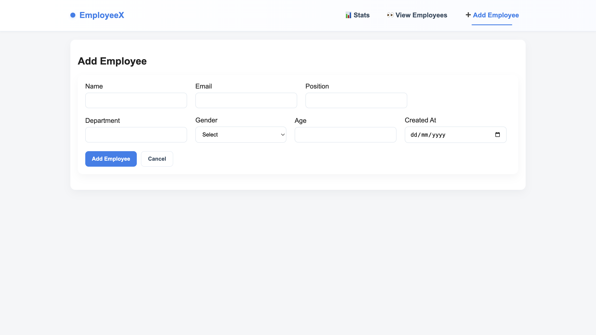
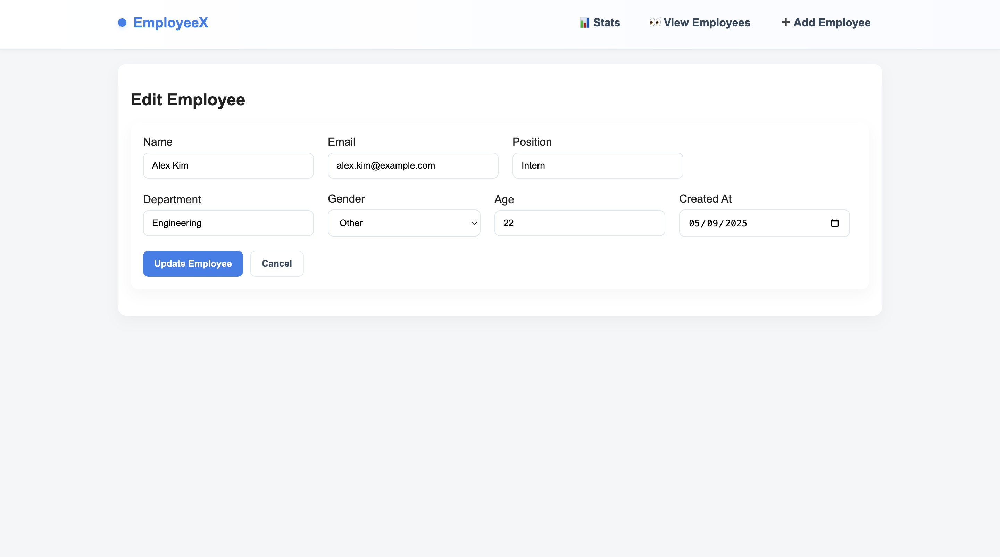

# EmployeeX

EmployeeX is a full-stack employee management system built with **React** (frontend), **Spring Boot** (backend), and **SQLite** (database).  
It allows organizations to efficiently manage employee records with CRUD operations, search functionality, and insightful dashboard KPIs — all in a clean and modern UI.

---

## 📌 Features

- ➕ **Add Employees** – Create new employee records with form validation.  
- 📝 **Edit Employees** – Update existing employee details.  
- ❌ **Delete Employees** – Remove employees from the system.  
- 🔍 **Search Employees** – Quickly find employees by name or department.  
- 📊 **Dashboard & KPIs** – Visualize employee statistics (total employees, average age, gender distribution, department distribution).  
- ✅ **Form Validation** – Ensures proper data entry before submission.  
- 🎨 **Clean UI** – User-friendly design with responsive layout.

---

## 🏗️ Architecture

The project follows a **frontend-backend-database** structure:


- **Frontend** → React server (`employee-dashboard`)  
- **Backend** → Spring Boot server (`verto`)  
- **Database** → SQLite (lightweight file-based database)

---

## ⚙️ Installation & Setup

### 1. Clone the repository

```bash
git clone https://github.com/parimalongithub/Verto-hackathon.git
cd Verto-hackathon
```

---

### 2. Frontend (React)

Navigate into the frontend folder:

```bash
cd frontend
cd employee-dashboard
npm install
npm start
```

This will start the React app at `http://localhost:3000`.

---

### 3. Backend (Spring Boot)

Navigate into the backend folder:

```bash
cd backend
cd verto
```

#### Mac / Linux

```bash
./mvnw spring-boot:run
```

#### Windows

```bash
mvnw.cmd spring-boot:run
```

The backend will start at `http://localhost:8080`.

---

## 🚀 API Endpoints

| Method | Endpoint                   | Description                |
|--------|----------------------------|----------------------------|
| GET    | `/api/employees`           | Get all employees          |
| GET    | `/api/employees/{id}`      | Get employee by ID         |
| POST   | `/api/employees`           | Add a new employee         |
| PUT    | `/api/employees/{id}`      | Update an existing employee|
| DELETE | `/api/employees/{id}`      | Delete an employee by ID   |
| GET    | `/api/employees/dashboard` | Get dashboard statistics   |

---

## 📸 Screenshots

You can add screenshots of your project here for better visualization.  
For example:  

### Dashboard Page


### Employee List


### Add Employee Form


### Edit Employee Page



---

## 📂 Project Structure

```
Verto-hackathon/
│── backend/
│   └── verto/            # Spring Boot backend
│       ├── src/main/java # Java code (controllers, services, models)
│       └── resources     # application.properties
│
│── frontend/
│   └── employee-dashboard/ # React frontend
│       ├── src/components  # React components
│       └── src/App.js      # Main entry
│
└── README.md
```

---

## 🛠️ Tech Stack

- **Frontend**: React, Recharts, Toastify, CSS  
- **Backend**: Spring Boot, Hibernate JPA  
- **Database**: SQLite  
- **Build Tools**: Maven, npm

---

## ⚠️ Common Errors & Fixes

### 1. `Cannot load driver class: org.sqlite.JDBC`
- Ensure the SQLite JDBC dependency is added in your `pom.xml`.

### 2. `no such column: age`
- Happens if you changed the entity but SQLite schema wasn’t updated.  
- **Fix**: Delete `employees.db` file and restart the backend (schema will be recreated).

### 3. React app doesn’t connect to backend
- Make sure Spring Boot is running on `http://localhost:8080`.  
- If you changed the backend port, update API URLs in `frontend/src/api.js`.

### 4. `npm start` fails
- Delete `node_modules` and run `npm install` again.  
- Ensure you are inside the correct folder: `frontend/employee-dashboard`.

---
