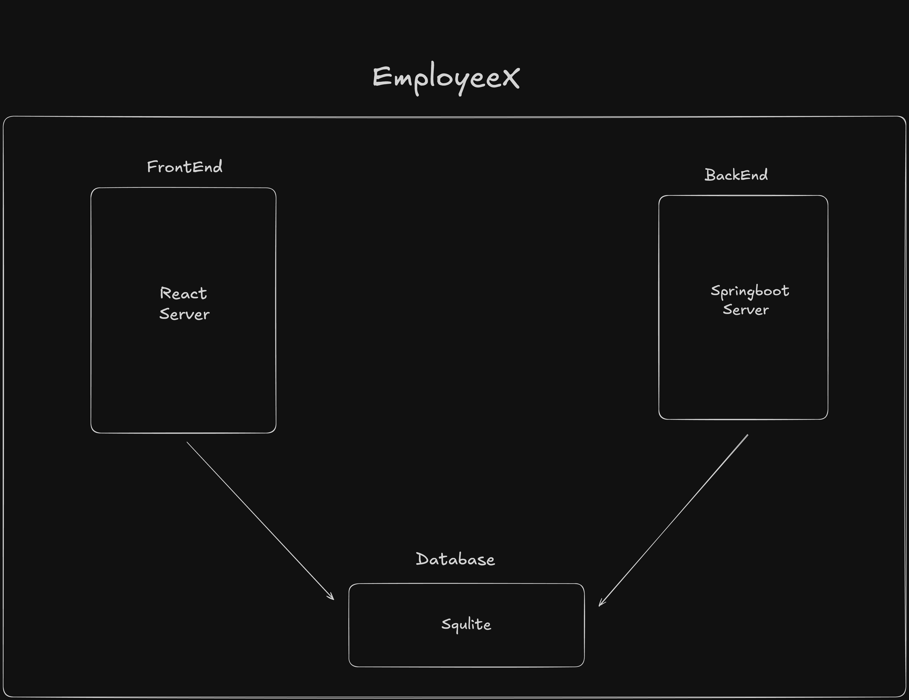

# EmployeeX

EmployeeX is a full-stack employee management system built with **React** (frontend), **Spring Boot** (backend), and **SQLite** (database).  
It allows organizations to efficiently manage employee records with CRUD operations, search functionality, and insightful dashboard KPIs — all in a clean and modern UI.

---

## 📌 Features

- ➕ **Add Employees** – Create new employee records with form validation.  
- 📝 **Edit Employees** – Update existing employee details.  
- ❌ **Delete Employees** – Remove employees from the system.  
- 🔍 **Search Employees** – Quickly find employees by name or department.  
- 📊 **Dashboard & KPIs** – Visualize employee statistics (total employees, average age, gender distribution, department distribution).  
- ✅ **Form Validation** – Ensures proper data entry before submission.  
- 🎨 **Clean UI** – User-friendly design with responsive layout.

---

## 🏗️ Architecture

The project follows a **frontend-backend-database** structure:



- **Frontend** → React server (`employee-dashboard`)  
- **Backend** → Spring Boot server (`verto`)  
- **Database** → SQLite (lightweight file-based database)

---

## ⚙️ Installation & Setup

### 1. Clone the repository

```bash
git clone https://github.com/parimalongithub/Verto-hackathon.git
cd Verto-hackathon
```

---

### 2. Frontend (React)

Navigate into the frontend folder:

```bash
cd frontend
cd employee-dashboard
npm install
npm start
```

This will start the React app at `http://localhost:3000`.

---

### 3. Backend (Spring Boot)

Navigate into the backend folder:

```bash
cd backend
cd verto
```

#### Mac / Linux

```bash
./mvnw spring-boot:run
```

#### Windows

```bash
mvnw.cmd spring-boot:run
```

The backend will start at `http://localhost:8080`.

---

## ⚡ Database Configuration

SQLite is used as the database. The configuration is defined in `src/main/resources/application.properties`.


⚠️ **Important:** Use  
- `spring.jpa.hibernate.ddl-auto=update` → while developing, to persist data across server restarts.  
- Avoid `create-drop` unless you want data reset on every restart.

---

## 🚀 Running the App

1. Start the **backend** (Spring Boot).  
2. Start the **frontend** (React).  
3. Access the app at → `http://localhost:3000`

---

## 📸 Screenshots

(Add your project screenshots here)

- Dashboard Page  
- Employee List  
- Add Employee Form  
- Edit Employee Page  

---

## 📂 Project Structure

```
Verto-hackathon/
│── backend/
│   └── verto/            # Spring Boot backend
│       ├── src/main/java # Java code (controllers, services, models)
│       └── resources     # application.properties
│
│── frontend/
│   └── employee-dashboard/ # React frontend
│       ├── src/components  # React components
│       └── src/App.js      # Main entry
│
└── README.md
```

---

## 🛠️ Tech Stack

- **Frontend**: React, Recharts, Toastify, CSS  
- **Backend**: Spring Boot, Hibernate JPA  
- **Database**: SQLite  
- **Build Tools**: Maven, npm

---
